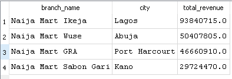
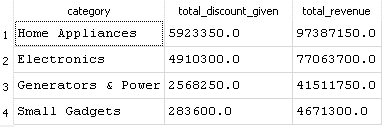
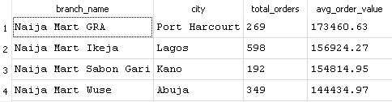

# Naija Mart Multi-Branch Sales Analysis

## Overview
Naija Mart is a fictional Nigerian retail chain selling electronics, home appliances, small gadgets, and generators across four branches: Lagos, Abuja, Port Harcourt, and Kano. This project analyzes branch performance, discount strategy, and order patterns to identify where revenue is strongest and where opportunities exist.

**Tools used:** SQL (SQLite), Excel, Power BI

## Key Takeaway

Naija Mart's Lagos (Ikeja) branch is the strongest performer by both 
revenue and order volume, while Home Appliances is the top-performing 
product category. Revenue is highly seasonal, with a sharp increase in 
Q4 driven by festive-season demand. Discounting appears to be used 
selectively rather than as a broad sales driver, since most transactions 
happen at full price.

---

## Part 1: SQL — Data Extraction & Cleaning

### Q1: Which branch generates the most revenue?

**Query:**
```sql
SELECT 
    b.branch_name,
    b.city,
    ROUND(SUM(t.quantity * p.unit_price * (1 - COALESCE(t.discount_pct, 0) / 100.0)), 2) AS total_revenue
FROM transactions AS t
JOIN branches AS b
    ON t.branch_id = b.branch_id
JOIN products AS p
    ON t.product_id = p.product_id
GROUP BY b.branch_name, b.city
ORDER BY total_revenue DESC;
```

**Result:**


**Insight:** Lagos generates nearly double the revenue of the next closest branch, confirming its position as Naija Mart's strongest market. Kano trails significantly behind the other three branches, which may point to lower local demand, less brand awareness, or an opportunity worth investigating further.

---
### Q2: Which product category has the highest total discount given, and does that match where the most revenue comes from?

**Query:**
```sql
SELECT 
    p.category,
    ROUND(SUM(t.quantity * p.unit_price * (COALESCE(t.discount_pct, 0) / 100.0)), 2) AS total_discount_given,
    ROUND(SUM(t.quantity * p.unit_price * (1 - COALESCE(t.discount_pct, 0) / 100.0)), 2) AS total_revenue
FROM transactions AS t
JOIN products AS p
    ON t.product_id = p.product_id
GROUP BY p.category
ORDER BY total_discount_given DESC;
```

**Result:**


**Insight:** Home Appliances and Electronics receive the highest total discounts but also generate the highest revenue, suggesting the discount strategy is currently well-aligned with Naija Mart's top-performing categories rather than being wasted on low-value items. Note: transactions with missing discount values were treated as 0% discount for this calculation.

---
### Q3: What's the average order value per branch?

**Query:**
```sql
SELECT 
    b.branch_name,
    b.city,
    COUNT(t.transaction_id) AS total_orders,
    ROUND(AVG(t.quantity * p.unit_price * (1 - COALESCE(t.discount_pct, 0) / 100.0)), 2) AS avg_order_value
FROM transactions AS t
JOIN branches AS b
    ON t.branch_id = b.branch_id
JOIN products AS p
    ON t.product_id = p.product_id
GROUP BY b.branch_name, b.city
ORDER BY avg_order_value DESC;
```

**Result:**


**Insight:** Port Harcourt has the highest average order value despite having far fewer transactions than Lagos, suggesting customers there tend to buy higher-priced items less frequently. Lagos, in contrast, drives its revenue lead through sheer order volume rather than bigger purchases, implying the two branches may benefit from different sales strategies.

---
In this section, I used SQL to answer 3 core business questions: which 
branches generate the most revenue, how discount spend compares across 
product categories, and which branches have the highest average order 
value. Each query was written, tested, and verified against the raw data.

## Part 2: Excel — Deeper Analysis

After completing the SQL analysis, I moved the raw data into Excel to clean it 
further, cross-validate my SQL findings using a different tool, and uncover a 
trend that SQL hadn't surfaced.

**Data Cleaning performed:**
- Standardized inconsistent city names (e.g. "PH", "Port-Harcourt" → "Port Harcourt")
- Removed 8 duplicate transaction rows
- Filled 49 blank discount values with 0 (no discount applied)
- Labeled missing customer cities as "Unknown" rather than guessing or deleting, 
  to preserve data honesty
- Fixed inconsistent date formats using Text to Columns

### 1. Branch Revenue
**Steps:** Built a PivotTable with `branch_name` in Rows and `revenue` in Values.
**Screenshot:** `excel_branch_revenue.PNG`
**Insight:** Lagos (Ikeja) leads all branches at ₦93.8M, nearly double the 
second-highest branch confirming the same ranking found in my SQL analysis 
and validating the accuracy of both approaches.

### 2. Revenue by Category
**Steps:** Built a PivotTable with `category` in Rows and `revenue` in Values.
**Screenshot:** `excel_category_revenue.PNG`
**Insight:** Home Appliances is the top revenue category (₦97.4M), followed 
by Electronics (₦77.1M) matching my SQL findings exactly and reinforcing 
that discount spend is well-aligned with the highest-revenue categories.

### 3. Average Order Value by Branch
**Steps:** Built a PivotTable with `branch_name` in Rows and `revenue` 
(set to Average) in Values.
**Screenshot:** `excel_avg_order_value.PNG`
**Insight:** Port Harcourt has the highest average order value (₦173,460) 
despite ranking third in total revenue showing that Lagos's lead is driven 
by transaction volume, while Port Harcourt customers spend more per visit.

### 4. Monthly Revenue Trend
**Steps:** Extracted month from each transaction date, built a PivotTable 
with `month` in Rows and `revenue` in Values, then visualized it as a line chart.
**Screenshot:** `excel_monthly_trend.PNG`
**Insight:** Revenue stayed relatively flat through the first three quarters, 
then rose sharply in Q4 peaking in December at ₦29.9M, nearly 2.4x higher 
than the lowest month (July, ₦12.3M). This aligns with typical retail 
seasonality, where end-of-year holidays drive higher spending.
In this section, I cleaned the raw dataset in Excel (handling duplicates, 
missing values, and inconsistent formatting), then built 4 PivotTables 
with charts to validate my SQL findings using a different tool. This also 
surfaced a new insight: a strong revenue spike in Q4, tied to seasonal 
shopping trends.

## Part 3: Power BI Dashboard

To bring the analysis together for a non-technical audience, I built a 
2-page interactive dashboard in Power BI Service. I chose a warm, 
retail-inspired color palette (terracotta orange as the accent, deep 
teal as the base color) applied consistently across every visual, 
rather than using default chart colors.

**Live Dashboard:** [View on Power BI](YOUR_PUBLISHED_LINK_HERE)

### Page 1: Overview
**Screenshot:** `powerbi_page1_overview.png`

This page gives a high level summary for quick decision making:
- 4 key metric cards: Total Revenue (₦221M), Total Orders (1,408), 
  Average Order Value (₦156.7K), and Top Branch (Ikeja)
- A Revenue by Branch column chart, with the top performing branch 
  highlighted in orange to draw immediate attention
- A Revenue by Category bar chart, using the same highlight pattern

**Insight:** Lagos (Ikeja) is the clear leader in both total revenue and 
transaction volume, while Home Appliances is the top performing category. 
This is consistent with both the SQL and Excel findings, confirming the 
accuracy of the analysis across all three tools.

### Page 2: Trends and Deeper Analysis
**Screenshot:** `powerbi_page2_trends.png`

This page allows deeper, interactive exploration:
- A Monthly Revenue Trend line chart showing the Q4 seasonal spike
- An interactive branch slicer, letting users filter the trend by 
  individual branch
- A Discount % vs Quantity Sold scatter chart, a new analysis not 
  covered in the SQL or Excel sections
- A written key insight callout directly on the dashboard

**Insight:** Revenue climbs sharply in the final quarter of the year, 
peaking in December. Interestingly, transaction volume was highest at 
0% discount and declined as discount percentage increased. This suggests 
that deep discounts are used selectively on fewer transactions, rather 
than being the primary driver of sales volume.
In this section, I brought the cleaned data into Power BI Service to 
build a 2-page interactive dashboard for a non-technical audience. Beyond 
presenting the findings visually, I used a scatter chart to explore the 
relationship between discount percentage and quantity sold, uncovering 
a pattern not visible in the SQL or Excel analysis alone.

## Conclusion

This project set out to answer a real business question: which branches 
and product categories are driving Naija Mart's performance, and what 
patterns in customer behavior can inform future strategy? By working 
through the same dataset with three different tools, I was able to both 
validate my findings and add new layers of insight at each stage. SQL 
gave a fast, precise way to answer direct business questions. Excel added 
a visual, cross-checked view of the data alongside a monthly trend 
analysis. Power BI brought everything together into a single interactive 
dashboard that a non-technical stakeholder could explore on their own. 
Together, this workflow reflects how a real analyst moves from raw data 
to a decision-ready deliverable.
